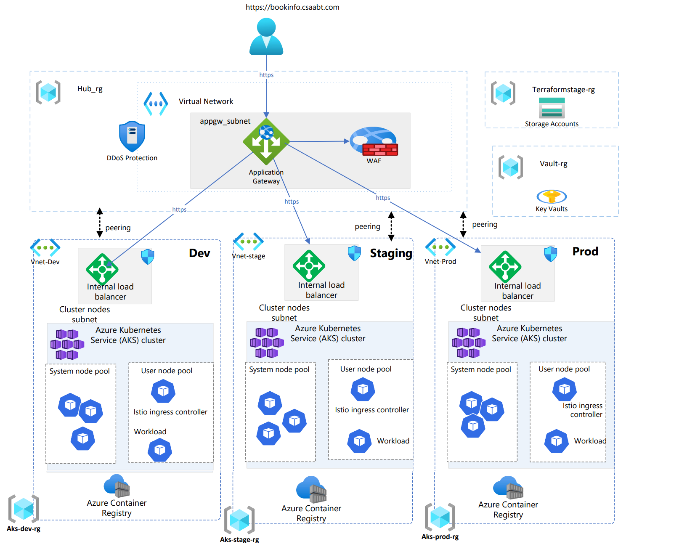
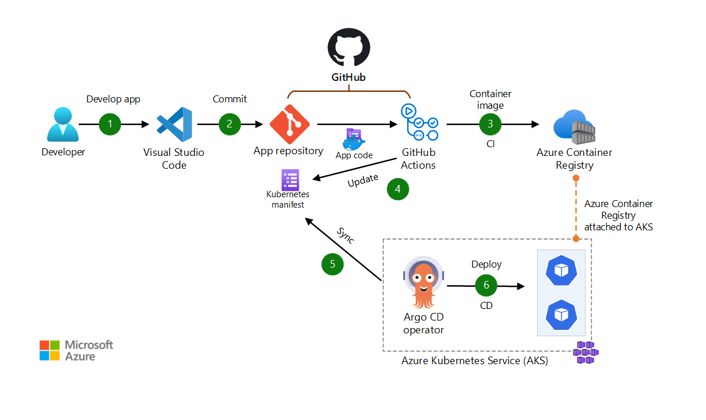

# Bookinfo Sample Microservices(Istio) and terraform hub spoke deployment

This repository encompasses both enterprise architecture guidelines and a reference implementation for deploying the Azure Kubernetes cluster. It includes best practices, considerations and deployable artifacts for implementing a common reference architecture.

- [AKS Baseline Architecture](https://learn.microsoft.com/en-us/azure/architecture/reference-architectures/containers/aks/baseline-aks)

- [AKS Baseline Terraform](https://github.com/abhishektyagi9/aks-baseline-automation/blob/main/.github/workflows/IaC-terraform-AKS.yml)

- [AKS landing Zone](https://github.com/Azure/AKS-Landing-Zone-Accelerator)
## Architecture Overview



## Requirements

### Tools

These tools must be present in your environment to execute the different stacks of the project:

- [Git](https://git-scm.com/downloads)
- [Python 3.7](https://www.python.org/downloads/release/python-370/)
- [Azure CLI 2.18.0](https://docs.microsoft.com/en-us/cli/azure/install-azure-cli)
- [Terraform 0.14.5](https://www.terraform.io/downloads.html)
- [kubectl 1.20.1](https://kubernetes.io/docs/tasks/tools/install-kubectl/)
- [helm 3.2.1](https://helm.sh/docs/intro/install/)

> You can build a Docker base image including all these requirements in order to guarantee that all team members and your CI tool use exactly the same environment to work with the project.

## Deployment

In this example project each stack get its own dedicated Resource Group.

>Depends on your way of working, you may prefer having the backend Account Storage and Key Vault in a same `Common` resource group, or in the `hub` resource group.
Maybe you haven't enough permissions to create Resource Group in your subscription and someone else from IT team will provide them to you. In these different use cases you will have to adapt the code a little bit to feet your needs.

### Service principal for Terraform

[Setup Service Principal for Terraform](terraformIAC/docs/tf_azure_authent.md)

### Backend

Terraform needs a shared storage to store state files.
In Azure, stores the state as a Blob with the given Key within the Blob Container within the Blob Storage Account. This backend also supports state locking and consistency checking via native capabilities of Azure Blob Storage.

[Create the terraform backend if it doesn't already exists](terraformIAC/docs/tf_backend.md)

### Key vault

Infrastructure stacks often need a secret manager and this corresponds to good practices tu use one. So we will provision an Azure Key Vault before building the hub and spoke infrastructure.

This stack create the Key Vault itself but will also be responsible for maintaining permission delegations to users, groups and applications of the company to consume or manage secrets, keys and certificates.

[Deploy the Key Vault if it doesn't already exists](terraformIAC/terraform/vault/README.md)

### Infrastructure

The infrastructure is divided in two different terraform stacks containing resources which will have different lifecycle:

- `aks`
  - implements an AKS environment
  - use terraform workspace to manage multiple environments with their specificities
- `hub`
  - implements the hub containing cross environment components like:
    - connectivity with Internet or DC
    - eventually a Bastion
    - DNS resources

#### Create a spoke AKS environment

[Follow these instruction to create an AKS environment](terraformIAC/terraform/aks/README.md)

#### Create the hub

[Follow these instruction to create the hub](terraformIAC/terraform/hub/README.md)


# Bookinfo Sample

See <https://istio.io/docs/examples/bookinfo/>.


# IstioService Mesh Add-on

See <https://learn.microsoft.com/en-us/azure/aks/istio-deploy-addon>.

```
az aks mesh enable --resource-group ${RESOURCE_GROUP} --name ${CLUSTER}
```

****Istio Ingress ****
- See <https://learn.microsoft.com/en-us/azure/aks/istio-deploy-ingress>
  
- Roadmap <https://techcommunity.microsoft.com/t5/apps-on-azure-blog/istio-based-service-mesh-add-on-for-azure-kubernetes-service/ba-p/3800229>

Enable external Ingress:

```
az aks mesh enable-ingress-gateway --resource-group $RESOURCE_GROUP --name $CLUSTER --ingress-gateway-type external
```

Enable Internal Ingress:

```
az aks mesh enable-ingress-gateway --resource-group $RESOURCE_GROUP --name $CLUSTER --ingress-gateway-type internal
```

# Book sample deployment using Gitops

[AKS Gitops](https://learn.microsoft.com/en-us/azure/architecture/example-scenario/gitops-aks/gitops-blueprint-aks#scenario-4-use-gitops-with-argo-cd-github-actions-and-aks-to-implement-cicd)

[Argocd](https://argo-cd.readthedocs.io/en/stable/)


This scenario is a pull-based DevOps pipeline for a typical web application. The pipeline uses GitHub Actions for build. For deployment, it uses Argo CD as the GitOps operator to pull and sync the app. The data flows through the scenario as follows:

- The app code is developed by using an IDE such as Visual Studio Code.
- The app code is committed to a GitHub repository.
- GitHub Actions builds a container image from the app code and pushes the container image to Azure Container Registry.
- GitHub Actions updates a Kubernetes manifest deployment file with the current image version that's based on the version number of the container image in Azure Container Registry.
- Argo CD pulls from the Git repository.]
- Argo CD deploys the app to the AKS cluster.

# Monitoring of Clusters and Service mesh

- [Install Kiali into AKS-istio-system namespace](https://kiali.io/docs/installation/installation-guide/install-with-helm/)

```
$ helm install \
    --set cr.create=true \
    --set cr.namespace=aks-istio-system \
    --namespace kiali-operator \
    --create-namespace \
    kiali-operator \
    kiali/kiali-operator
```
- [Install prometheus into AKS-istio-system namespace]([https://kiali.io/docs/installation/installation-guide/install-with-helm/](https://istio.io/latest/docs/ops/integrations/prometheus/))
```
kubectl apply -f https://raw.githubusercontent.com/istio/istio/release-1.18/samples/addons/prometheus.yaml

```
**start kiali dashboard:**
```
 kubectl port-forward svc/kiali 20001:20001 -n aks-istio-system
```

**Generate Kiali token for Authentication:**
```
kubectl -n aks-istio-system create token kiali-service-account
```

**Access Kiali dashboard:**

```
http://localhost:20001
```


## Conclusion

You have built a first version of an hub and spoke infrastructure for your AKS environements.
Obviously there are still things to add and maybe some things need to be adapted to your specific context, but this is a first basis for work.
