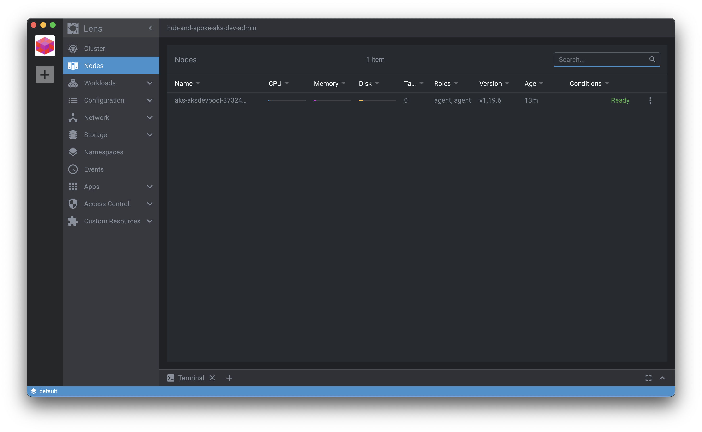

# AKS environment

## Requirement

You need to check few things before executing the stack.

### Create workspaces

Create the different workspace we need if they don't exist:

```bash
$ cd terraform/aks
$ terraform init
$ terraform workspace new prod
$ terraform workspace new staging
$ terraform workspace new dev
```

### Current terraform worspace

Terraform will create or update the environment corresponding to the current worspace.

Discover the workspaces:

```bash
# Show workspace list
$ terraform workspace list
  default
* dev
  prod
  staging

# Show current workspace
$ terraform workspace show
dev
```

Select the workspace corresponding to the environment you want to work on:

```bash
$ terraform workspace select dev
Switched to workspace "dev".
```

The terraform state for each workspace is stored in a dedicated state file.
All these terraform state files are stored in the same backend.

### AKS SSH key pair

The stack need an SSH key pair to allow SSH connection to the AKS nodes.

- The key pair must exist and have been pushed into the Azure Key Vault before executing the stack.

#### Generate a new SSH key pair

Use the following script to generate an SSH key pair and push resulting file as secrets in the Key Vault:

```bash
$ cd scripts
$ ./aks_key_pair.sh [dev|staging|prod]
```

### Check variables for the current environment

Check the variables for the current environment (workspace) in the file [`variables.tf`](variables.tf).

#### AKS public SSH key

The name of the secret in Key Vault that contains the public SSH key deployed in AKS nodes of each environment:

```hcl
variable "ssh_pub_key_secret_name" {
  type = map
  default = {
    "dev"       = "aks-dev-ssh-pub"
    "staging"   = "aks-test-ssh-pub"
    "prod"      = "aks-prod-ssh-pub"
  }
}
```

#### AKS node size

The size of Azure virtual machines provision in AKS node pool for each environment:

```hcl
variable "node_size" {
  type = map
  default = {
    "dev"       = "standard_ds3_v2" # 4vCPUs, 14GiB
    "staging"   = "standard_ds3_v2" # 4vCPUs, 14GiB
    "prod"      = "standard_ds3_v2" # 4vCPUs, 14GiB
  }
}
```

> Please note that [not all sizes are compatible with the ephemeral disks](https://docs.microsoft.com/en-us/azure/virtual-machines/ephemeral-os-disks) recommended by Microsoft for AKS environments.

#### AKS node count

The number of nodes in the AKS pool for each environment:

```hcl
variable "node_count" {
  type = map
  default = {
    "dev"       = 1
    "staging"   = 1
    "prod"      = 2
  }
}
```

#### Private load balancer IP

Private IP address used for Ingress load balancer:

```hcl
variable "aks_ingress_lb_ip" {
  type = map
  default = {
    "dev"       = "10.1.127.200"
    "staging"   = "10.2.127.200"
    "prod"      = "10.4.127.200"
  }
}
```

#### Max pod number per node

The max pod number per node:

```hcl
variable "aks_max_pod_number" {
  type    = map
  default = {
    "dev"    = 100
    "test"   = 100
    "prod"   = 100
  }
}
```

The AKS service will reserve IP in the subnetf or all that number of pods.
That's why it is important to choose an IP for the load balancer at the end of the range.

## Deploy

Deploy the stack:

```bash
$ terraform apply
```

If gou get an error like bellow, [adapt Service Principal permissions on API as described in this post](https://github.com/hashicorp/terraform-provider-azuread/issues/131).

```bash
* azuread_application.example: graphrbac.ApplicationsClient#Create: Failure responding to request: 
StatusCode=403 -- Original Error: autorest/azure: Service returned an error. Status=403 Code="Unknown" 
Message="Unknown service error" Details=[{"odata.error":{"code":"Authorization_RequestDenied",
"date":"2019-08-06T00:08:31","message":{"lang":"en","value":"Insufficient privileges to 
complete the operation."} ,"requestId":"78a334e1-27e6-4933-af8c-5809a08e384b"}}]
```

## Get AKS cluster credentials

Use the Azure CLI to get the cluster credentials:

```bash
$ az aks get-credentials -g hub-and-spoke-aks-dev -n hub-and-spoke-aks-dev -a --overwrite
```

Don't forget to adapt names with the current workspace name.

Then you can directly use kubectl:

```bash
$ kubectl get nodes
NAME                                 STATUS   ROLES   AGE   VERSION
aks-aksdevpool-37324794-vmss000000   Ready    agent   13m   v1.19.6
```

Or adding the cluster in [Lens](https://www.mirantis.com/software/lens/):



## Install ingress controller

The terraform stack that create the AKS cluster cannot also use kubernetes and/or helm providers because of instabilities, it is well explained in [this article](https://itnext.io/terraform-dont-use-kubernetes-provider-with-your-cluster-resource-d8ec5319d14a)

We can follow the [Azure documentation for installing nginx ingress controller](https://docs.microsoft.com/en-us/azure/aks/ingress-internal-ip#create-an-ingress-controller):

```bash
# Add the repo
$ helm repo add ingress-nginx https://kubernetes.github.io/ingress-nginx

# Use Helm to deploy an NGINX ingress controller
$ helm install nginx-ingress ingress-nginx/ingress-nginx \
    -f ingress/dev.yaml \
    --set controller.replicaCount=2
```

> Use the file corresponding to the current environment your are working on.

## Install demo app

Deploy the demo app:

```bash
$ kubectl create namespace demo
$ kubectl apply -f app/demo-dev.yaml
```

> Use the right file depending on the current environement

## Check connectivity

### Network connectivity

```bash
# Launch ubuntu pod
$ kubectl apply -f https://gist.githubusercontent.com/tcdowney/b8a0297241b74f94ef1fc6627f7ea69a/raw/eaae035f5adca37ca00d4a49f1c1958fe3db89e3/ubuntu-sleep.yaml

# Open a shell in the ubuntu pod
$ kubectl exec -it ubuntu -- /bin/bash

# Install tools
$ apt update && apt install curl iputils-ping wget -y

$ wget google.fr
Resolving google.fr (google.fr)... 172.217.169.67, 2a00:1450:4009:818::2003
Connecting to google.fr (google.fr)|172.217.169.67|:80... connected.
HTTP request sent, awaiting response... 301 Moved Permanently
Location: http://www.google.fr/ [following]
--2021-02-09 13:42:10--  http://www.google.fr/
Resolving www.google.fr (www.google.fr)... 216.58.210.195, 2a00:1450:4009:81a::2003
Connecting to www.google.fr (www.google.fr)|216.58.210.195|:80... connected.
HTTP request sent, awaiting response... 200 OK
Length: unspecified [text/html]
Saving to: 'index.html'

index.html                                             [ <=>                                                                                                            ]  13.43K  --.-KB/s    in 0.01s

2021-02-09 13:42:10 (981 KB/s) - 'index.html' saved [13752]

```

### Ingress

Test that you can access the demo app requesting the private load balancer:

```bash
# Open a shell in the ubuntu pod
$ kubectl exec -it ubuntu -- /bin/bash

# Request the app 
$ curl -H "Host: dev.linkbynet.com" 10.1.127.200
```

Check that you get the Nginx welcome page.

---
<!DOCTYPE html>
<html>
<head>
<title>Welcome to nginx!</title>
<style>
    body {
        width: 35em;
        margin: 0 auto;
        font-family: Tahoma, Verdana, Arial, sans-serif;
    }
</style>
</head>
<body>
<h1>Welcome to nginx!</h1>
<p>If you see this page, the nginx web server is successfully installed and
working. Further configuration is required.</p>

<p>For online documentation and support please refer to
<a href="http://nginx.org/">nginx.org</a>.<br/>
Commercial support is available at
<a href="http://nginx.com/">nginx.com</a>.</p>

<p><em>Thank you for using nginx.</em></p>
</body>
</html>
---
