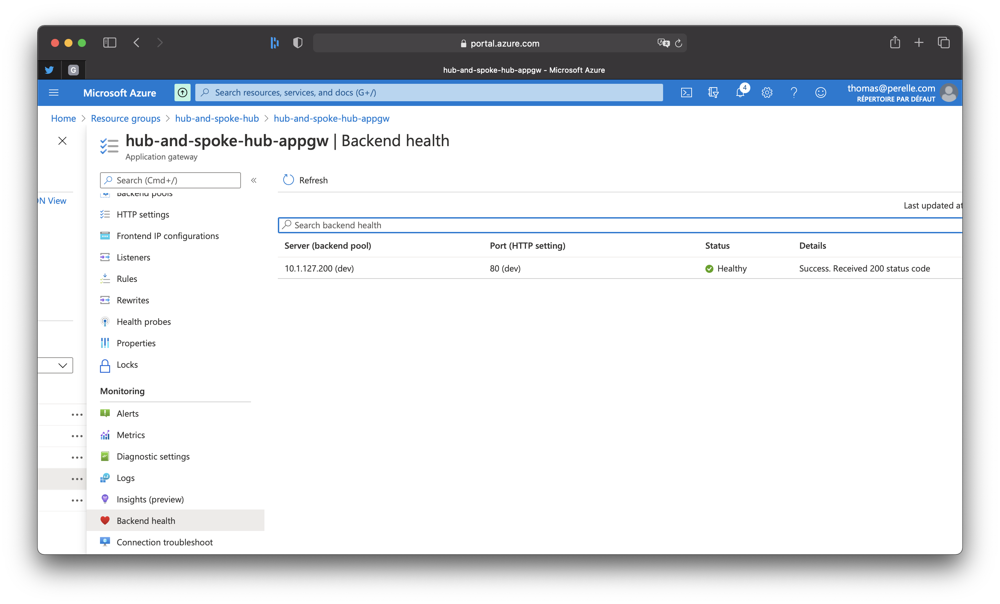

# Hub

This stack deploy the common infrastructure, mainly the exposition of service to Internet.

## Requirement

### SSL certiticate

Generate the wildcard SSL certiticate for the domain you want to use.
Push it in the key vault as certificate.

It is also possible to use multiple certificates for différents domains or for different dedicated records. Just adapt the application gateway configuration (http_listener, request_routing_rule) accordingly.

### Check variables

Check the variables of the stack in the file [variables.tf](./variables.tf).

#### Domain

Name of the domain to use:

```hcl
variable "domain" {
  type    = string
  default = "linkbynet.com"
}
```

#### Certificate

The name of the wildcard certificate corresponding to the domain if you want to use the Application Gateay for SSL termination:

```hcl
variable "certificate_wildcard_name_in_vault" {
  type    = string 
  default = "wildcard-linkbynet-com"
}
```

> **Note**: It is used only if you set the `ssl_certificate` block [in the application gateway resource](application_gateway.tf).

#### Application DNS

the list of the DNS of your applications that you have pointed to the public IP of the gateway application and need to be redirected to the right AKS environments:

```hcl
variable "exposed_dns" {
  type = map
  default = {
    "app-dev" = {
      "dns"       = "dev.linkbynet.com"
      "env"       = "dev"
      "protocol" = "Http"
    }
  }
}
```

> **Note**:
>
> - In this example I use a http listner because I don't have control over the domain I'm using
> - If you configure the SSL termination on the Application Gateway, you should indicate the `Https` protocol instead
> - These DNS are also the ones used in the ingress rules when deploying application in the different environments

#### Vnet peering

Adapt the list of vnets you want to peer with the hub:

```hcl
# The name corresponds to both vnet name and resource group name
variable "vnet_spoke_to_peer" {
  type = list
  default = [
    "hub-and-spoke-aks-dev"
  ]
}
```

> **Note**: All vnets in the list must exist or you may have errors when executing the stack.

## Provision or update infrastructure

Apply differences with the live infrastructure:

```bash
$ cd terraform/hub
$ terraform apply
```

## Check

Check the backend health of the Application Gateway.



> As long as the backend is not indicated as healthy the Application Gateway will never forward requests and you will get an HTTP 502 error (Bad Gateway).
